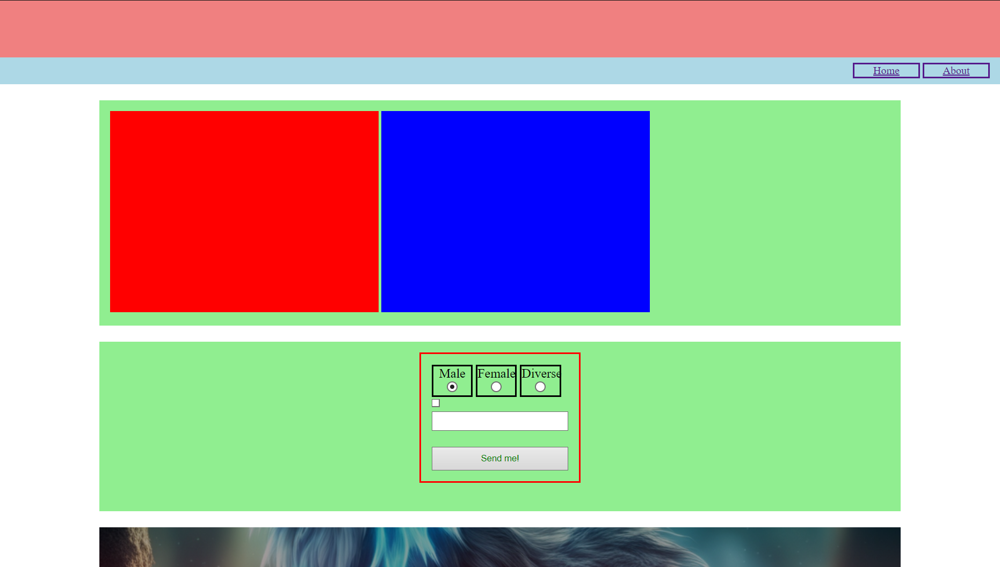
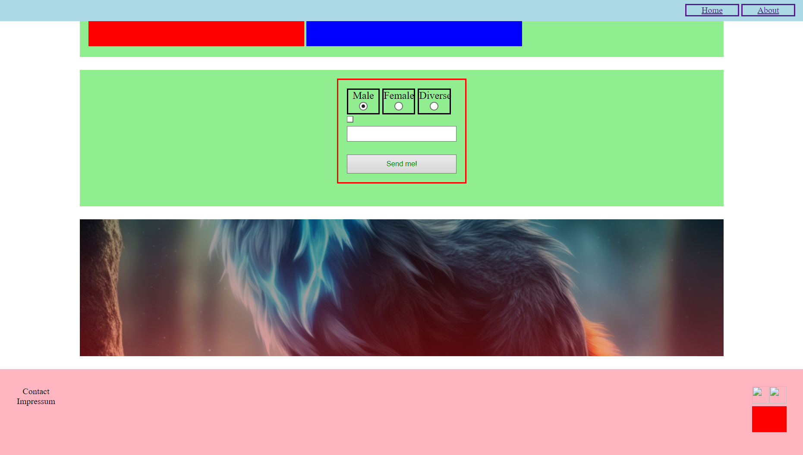

# Basic Recap

## Beantworte folgende Fragen

- Was ist das besondere an einem `block` Element?

  Antwort:

- Was ist das besondere an einem `inline` Element?

  Antwort:

- Was ist das besondere an einem `inline-block` Element?

  Antwort:

- Welche Art von Element ist ein `input` Element?

  Antwort:

- Welche Art von Element ist ein `table` Element?

  Antwort:

- Welche Art von Element ist ein `div` Element?

  Antwort:

- Welche Art von Element ist ein `a` Element?

  Antwort:

- Welche Art von Element ist ein `body` Element?

  Antwort:

- Welche Art von Element ist ein `form` Element?

  Antwort:

- Wann funktioniert `text-aline: center`?

  Antwort:

- Wie kann man ein `block` Element zentrieren?

  Antwort:

- Wie kennzeichnet man eine `id` im CSS?

  Antwort:

## Aufgaben

Die Hauptaufgabe wird es sein eine Webseite zu bauen, die dem Bild so ähnlich wie möglich kommt. Beachte hierbei folgende Punkte:

1. Der Header hat eine Höhe von 10% der Höhe des Viewports

2. Die Navigation hat eine Höhe von `40px`, allerdings in `rem` und bleibt oben am Fenster kleben (KLEBEN!).

   - Richte die Links rechts aus. **Benutze KEIN position!**

3. Alle Sections sind Zentriert, mindestens 30% der Höhe des Viewports hocht und haben haben `1.5rem` abstand zueinander.

   - Section 1
     - in dieser Section sind zwei Cards (`div`), die `400px` Breit und `300px` Hoch sind. **Benutze KEIN position!**
   - Section 2
     - Das Formular soll mittig ausgerechtet sein und eine Breite von `15rem` haben.

- Section 3
  - richte das Hintergrundbild so gut wie möglich aus
  - sorge dafür, dass das Hintergrundbild nur noch `60%` der ursprünglichen Helligkeit (`brightness`) hat.

4. Der Footer hat eine Höhe von `160px` in `rem`
   - Richte die Icons rechts und die Links links aus. **Nutze KEINE position!**

## Hilfestellung

[Klassen und ID´s](https://github.com/dci-fbw-wd-24-d07-a/resources/tree/main/02-UIB/01-fundamentals/02-UI-styles-classes-id#classes-vs-idś)

[Margin und Padding](https://github.com/dci-fbw-wd-24-d07-a/resources/tree/main/02-UIB/04-data/02-forms#formular)

[block, inline und inline-block](https://github.com/dci-fbw-wd-24-d07-a/resources/tree/main/02-UIB/02-Boxes/01-UI-Box-Model#ändern-der-eigenschaften-eines-elementes)

[Background Image vs Image](https://github.com/dci-fbw-wd-24-d07-a/resources/tree/main/02-UIB/02-Boxes/02-ui-bg#background-image-vs-image)

[Forms](https://github.com/dci-fbw-wd-24-d07-a/resources/tree/main/02-UIB/04-data/02-forms#formular)
